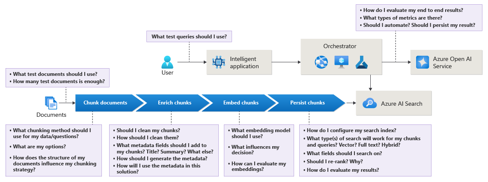
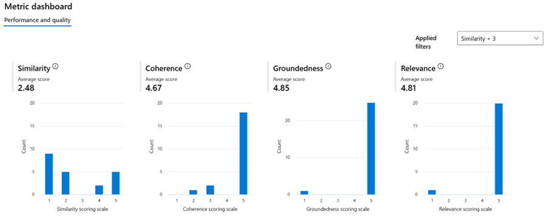
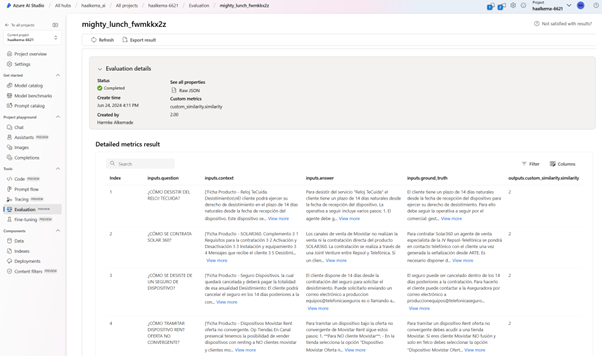
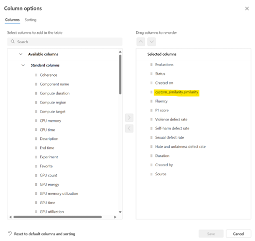
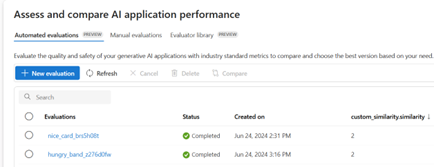

Contents

[1. RAG Project Assurance](#1.-RAG-Project-Assurance)

[2. Preparation phase and document analysis](#2.-Preparation-phase-and-document-analysis)

[2.1. Document collection for knowledge base](#2.1.-Document-collection-for-knowledge-base)

[2.1.1. Document analysis](#2.1.1.-Document-analysis)

[2.1.2. Sub-document (or section) analysis](#2.1.2.-Sub-document-(or-section)-analysis)

[2.1.3. Duplicate documents](#2.1.3.-Duplicate-documents)

[3. Chunk processing](#3.-Chunk-processing)

[3.1. Chunk documents](#3.1.-Chunk-documents)

[3.1.1. References](#3.1.1.-References)

[3.2. Chunk enrichment](#3.2.-Chunk-enrichment)

[3.3. Embed chunks and metadata](#3.3.-Embed-chunks-and-metadata)

[4. Search and retrieval](#4.-Search-and-retrieval)

[4.1. Azure AI Search configuration](#4.1.-Azure-AI-Search-configuration)

[4.2. Search retrieval and ranking](#4.2.-Search-retrieval-and-ranking)

[4.3. Search results re-ranking](#4.3.-Search-results-re-ranking)

[4.4. Search orchestration](#4.4.-Search-orchestration)

[5. Testing and evaluation](#5.-Testing-and-evaluation)

[5.1. Testing search results](#5.1.-Testing-search-results)

[5.2. Automatic generation of synthetic Q&A pairs](#5.2.-Automatic-generation-of-synthetic-Q&A-pairs)

[5.3. Testing end-to-end answer quality](#5.3.-Testing-end-to-end-answer-quality)

[5.3.1. Evaluation techniques](#5.3.1.-Evaluation-techniques)

[5.3.2	Testing the end-to-end process](#5.3.2-Testing-the-end-to-end-process)

[6. Summary of recommendations](#6.-Summary-of-recommendations)

[6.1. Recommendations related to issues detected](#6.1.-Recommendations-related-to-issues-detected)

[6.2. Recommendations related to improvements](#6.2.-Recommendations-related-to-improvements)

[7. List of code snippets](#7.-List-of-code-snippets)

[8. Appendices](#8.-Appendices)

[8.1. Section classification](#8.1.-Section-classification)

[8.2. Possible duplicate documents](#8.2.-Possible-duplicate-documents)

[8.3. Synthetic Q&A pairs generated](#8.3.-Synthetic-Q&A-pairs-generated)

# 1. RAG Project Assurance

The aim of this document is to reflect the recommendations to build a RAG (Retrieval-Augmented Generation) solution following the best practices.

This document is divided in sections that follow the standard order of implementation for an end-to-end review of this type of solution.

The following diagram represents the reference standard process that encompasses many of the different aspects to consider for a successful implementation of this solution:

# 2. Preparation phase and document analysis

Before starting to build the solution, it is important to assess the data that will be used both as a data source.

## 2.1. Document collection for knowledge base

Before deciding on a chunking and indexing strategy, it is important to consider the distribution of information in the document collection. To understand distribution is necessary to explore the data and consider the right options based on said exploration and analysis. Some specific document types might require additional preprocessing, such as tables, images or special characters.

### 2.1.1. Document analysis

The first step is determining the types of the documents and the format and structure of each document types and sub-documents.

#### [2.1.1.1. Document format: Convert HTML to markdown](./2.1.1.1.-Convert-HTML-to-markdown/README.md)

Every type of document could be in different format, as simple HTML, complex HTML with style tags, JSON, XML, etc.

If the original document is comprised of **HTML files that contain numerous style tags**, it could potentially be processed by the LLM and reformatted to the right style to build a response, but it is a good practice to clean the data and index only the semantically relevant content to optimize from a token usage perspective as well as to ensure this is not introducing noise in the final answer.

Here are the [details](./2.1.1.1.-Convert-HTML-to-markdown/README.md) and the code snippet.

#### [2.1.1.2. Document format: Length of the documents](./2.1.1.1.-Length-of-the-documents/README.md)

Another important aspect to assess is the length of the documents and paragraphs or sections in them. This is defined by number of tokens, which are fundamental units of text processed by language models, so for this analysis we will investigate token distribution across the document collection. There is no standard recommendation based on document length, it needs to be assessed for the specific use case and validate different strategies to find the most suitable one.

Here are the [details](./2.1.1.1.-Length-of-the-documents/README.md) and the code snippet.

### [2.1.2. Sub-document (or section) analysis](2.1.2.-Sub-document-analysis/README.md)

In the section above we looked at token distribution for complete documents, which we re-built by combining the corresponding sections for each unique document identification. We will now look into the separate sub-documents (or sections) to provide insights on what they contain as specific unit of information.

Here are the [details](./2.1.2.-Sub-document-analysis/README.md) and the code snippet.

### [2.1.3. Duplicate documents](./2.1.3.-Duplicate-documents/README.md)

In this section we analyze the appearance of very similar or duplicated documents that require a thorough review in order to potentially be removed or consolidated as a single document.

Here are the [details](./2.1.3.-Duplicate-documents/README.md) and the code snippet.

# 3. Chunk processing

## 3.1. Chunk documents

When implementing a RAG solution, it is important to make sure the documents are chunked in sub-documents with semantically relevant information, as well as keep a reasonable balance on the amount of information sent to the model to generate the final answer. If the sub-documents built from the documents are too small, they won’t provide enough information to generate a complete and correct answer, but if they are too long they will potentially introduce noise and irrelevant data in the answer built by the model.

In any RAG implementation, is it necessary to test different strategies with the specific documents of the knowledge base and reference question and answer pairs to select the optimal chunking strategy for a specific scenario.

There are a few common strategies that we recommend testing:

- **Langchain Semantic Chunking:** splits the text based on semantic similarity.
- **GPT-4o Semantic Chunking:** splits the text based on semantic similarity and set in the same chunk every sentence in the document that are semantic similar.
- **Langchain with Tiktoken with a maximum of 512 tokens and 25% of overlapping:** split the text based on a maximum of 512 tokens with an overlapping of 25% of tokens between chunks. If the document has got 512 tokens or less the document is not chunked.
- **Langchain with Tiktoken with a maximum of 1024 tokens and 25% of overlapping:** split the text based on a maximum of 1.024 tokens with an overlapping of 25% of tokens between chunks. If the document has got 1024 tokens or less the document is not chunked.

After the chunking and indexing processes, a different search and answer generation tests has to be conducted, in order to **determine with chunking technique is the best** for the specific document type of the project.

### 3.1.1. References

The following are sample references for the recommended chunking strategies mentioned above. It is also possible to use an ad-hoc chunking strategy specific to the document collection, or based on logical sections of content, but specially for larger collections this can be difficult to scale.

#### 3.1.1.1. Langchain Semantic Chunking

Microsoft’s AI GBB RAG Multimodal Accelerator: [multimodal-rag-code-execution/tutorials/12_Semantic_Chunking.ipynb at main · Azure-Samples/multimodal-rag-code-execution · GitHub](https://github.com/Azure-Samples/multimodal-rag-code-execution/blob/main/tutorials/12_Semantic_Chunking.ipynb)

#### [3.1.1.2. Semantic Chunking with GPT-4o](./3.1.1.2.-Semantic-Chunking-with-GPT-4o/README.md)

Here are the [details](./3.1.1.2.-Semantic-Chunking-with-GPT-4o/README.md) and the code snippet.

#### [3.1.1.3. Chunking with Langchain and Tiktoken with a maximum of 512/1024 tokens and 25% of overlapping](3.1.1.3.-Chunking-with-Langchain-with-max-tokens-and-overlapping/README.md)

Here are the [details](./3.1.1.3.-Chunking-with-Langchain-with-max-tokens-and-overlapping/README.md) and the code snippet.

## 3.2. Chunk enrichment

The standard flow in a RAG implementation is a user question to the system triggering a query in the knowledge base to retrieve the relevant information that will be then sent to the model to answer the user question. When this query is run, it contains not only the user question, but also specific filters based on additional metadata that help retrieve the right chunks from the index. For this to improve the search results it is important to define the right index structure and appropriate metadata for the chunks. Every chunk has to be enriched with metadata that will help Azure AI Search to retrieve the most pertinent content for the user’s query. The following is an example of an enriched chunk with different types of metadata:

There is not a fixed list of relevant metadata to include for every implementation, as it depends on the specific problem to solve as well as the type of information used in the solution. We typically recommend to have the chunk and its corresponding embeddings, as well as any additional fields that can act as a filter in the query to make the search results better.

**AS-IS:**

Specify current index fields configuration in Azure AI Search (if exists), identifying non-used fields:

For example:

| Field name | Comments | Searcheable | Used in the solution |
| --- | --- | --- | --- |
| DocumentID | Document ID from CMS | Yes/No | Yes/No |
| Title | Title of the document | Yes/No | Yes/No |
| Content | Main content of the document or section | Yes/No | Yes/No |
| Summary | Summary of the document | Yes/No | Yes/No |
| Keywords | Keywords about the document | Yes/No | Yes/No |
| DocumentType | Document type | Yes/No | Yes/No |
| FilterMetadata | Metadata that help to filter the search results by a business rule | Yes/No | Yes/No |
| StartDate | Date when the document starts to be retrieved by the search | Yes/No | Yes/No |
| EndDate | Date when the document ends to be retrieved by the search | Yes/No | Yes/No |
| embedding | Vector field with the embedded version of the content | Yes/No | Yes/No |

We recommend removing the fields that are part of the index but are not used for the search queries, to optimize the solution.

In general, for any indexation strategy, we recommend including only relevant fields for search or filtering and removing those that are not used. In many cases it can be useful as well to use dates to sort results and retrieve the most recent ones or leave the option for the final user of the platform to pick the dates or specific filters that they want the information to be based on.

Then, we can propose the list of metadata to enrich the chunks in the project, for example:

- **Title** **of the document**.
- **Keywords of the document:** this could be useful if the keywords are well prepared and are relevant to the content to help Azure AI Search to retrieve the associated content. The keywords could be improved using Azure AI Language service, that is able to extract automatically the key sentences from the documents to enrich the chunks:
- **Summary of the document**.
- **Questions** related to the document, defined manually by business users.
- **Filters field for user type**: The aim of search filters is to retrieve only the documents that are appropriate for the specific user. The project should find a technical way (likely with a rule engine easy to manage by business) to calculate the value for the type of user in a unique field, hiding the complexity of the rules and values, providing a more scalable and maintainable solution.

## 3.3 Embed chunks and metadata

An embedding is a mathematical way to represent an object, such as a piece of text that effectively captures the object's meaning. It has become a fundamental component in RAG implementation, as it allows mathematical comparison between text using similarity and distance.

In a Retrieval-Augmented Generation (RAG) solution, you typically use the same embedding model to process the user query as you did for your chunks. This allows you to search for the most relevant vectors in your database, returning the chunks that are most semantically similar. The original text of these relevant chunks is then given to the large language model as background information.

When selecting an embedding model, you need to balance performance and cost. Larger embedding models generally perform better on benchmark datasets, but they come with higher costs. These models produce larger vectors that need more storage space in a vector database and require more computational resources and time for comparing embeddings. On the other hand, smaller embedding models tend to have lower performance on the same benchmarks but are more cost-effective. They need less storage space and require less computational power and time for embedding comparisons. For the past year and a half the standard embeddings model has been Azure Open AI text-embeddings-ada-002, which provides really good results overall for different types of information. However, there were additional embeddings models published recently that might be good to consider if there was a need to improve this specific part of the solution.

For our assessment, we have conducted test with two Azure OpenAI embedding models: text-embedding-ada-002 (1536 dimensions) and text-embedding-3-large (3072 dimensions) and the search results with B2C content (the only one that we have the appropriate search filters) are very similar, so in this case model text-embedding-ada-002 is a good selection.

We also have to test several approaches of embedding fields:

- One embedding field created with ada-02 and with large-03, from the chunk content vectorized.
- One embedding field created with ada-02 and with large-03, from the title and chunk content.
- Two embedding fields created with ada-02 and with large-03: one with the title and another one with chunk content.
- Three embedding fields created with ada-02 and with large-03, from: one field with the title, other with the chunk content and another one with the rest of searcheable fields (keywords, summary, etc.)

# 4. Search and retrieval

As explained in the sections above, an index is defined through a schema of different fields containing different values. These fields have different purposes (normally text-based search, vector search, sorting or filtering), so it’s important that the right configuration is set in the index for the queries to retrieve the information correctly. This is done by setting specific attributes to each field based on the purpose they serve. The possible attributes are:

- Searchable
- Filterable
- Sortable
- Facetable
- Key
- Retrievable

These are set for each field when creating the index through the index schema. More details can be found at: [Search index overview - Azure AI Search | Microsoft Learn](https://learn.microsoft.com/en-us/azure/search/search-what-is-an-index).

## 4.1. Azure AI Search configuration

As explained above, it is essential that the fields that contain information related to the search query have the right attributes, so they have to be searchable or filterable, etc., depending of the use in the solution.

Another aspect to consider for the index configuration is the **NLP Analyzer**. An analyzer is part of the full-text search engine that handles the processing of strings during both indexing and query execution. This text processing, or lexical analysis, transforms a string through several actions:

- Removing unnecessary words (stopwords) and punctuation.
- Breaking down phrases and hyphenated words into their individual parts.
- Converting uppercase words to lowercase.
- Reducing words to their basic root forms for efficient storage and to ensure matches are found regardless of tense.

In general, it is important to configure the same analyzer in every searchable field to have a consistent NLP. For example, if the content are in Spanish the most appropriate is “es.microsoft”. More information about analyzers and the full list of options is available at: [Analyzers for linguistic and text processing - Azure AI Search | Microsoft Learn](https://learn.microsoft.com/en-us/azure/search/search-analyzers).

## 4.2. Search retrieval and ranking

Search Retrieval, often called L1, is designed to quickly find all the documents from the index that satisfy the search criteria, potentially across millions or billions of documents. These documents are then scored to select the top few (typically around 50) to return to the user or feed into the next layer.

Azure AI Search supports the following L1 modes:

- **Keyword search:** Uses traditional full-text search methods (content is broken into terms through language-specific text analysis) with probabilistic model for scoring based Term Frequency, Inverse Document Frequency and Field Length. It is useful because it prioritizes matching specific, important words that might be diluted in an embedding.
- **Vector search:** Documents are converted from text to vector representations using an embedding model. Retrieval is performed by generating a query embedding and finding the documents whose vectors are closest to the query’s. is powerful because embeddings are less sensitive to misspellings, synonyms, and phrasing differences and can even work in cross lingual scenarios.
- **Hybrid search:** Performs both keyword and vector retrieval and applies a fusion step to select the best results from each technique.

**Ranking**, also called L2, takes a subset of the top L1 results and computes higher quality relevance scores to reorder the result set. The L2 can improve the L1's ranking because it applies more computational power to each result. The L2 ranker can only reorder what the L1 already found – if the L1 missed an ideal document, the L2 can't fix that. L2 ranking is critical for RAG applications to make sure the best results are in the top positions.

**Semantic ranking** is performed by Azure AI Search's L2 ranker which utilizes multi-lingual, deep learning models adapted from Microsoft Bing. The Semantic ranker can rank the top 50 results from the L1.

**The best combination of search retrieval and ranking is the** **Hybrid Retrieval + Semantic Ranking**.

In general, in order to improve the search results, we recommend to create a **scoring profile** that includes a multiplier by 5 in the field **Title**, because this is an important field that provides relevant information about the documents, so if the words included in the user’s query appears in the Title those documents has to be prioritized.

## [4.3. Search results re-ranking](4.3.-Search-results-re-ranking/README.md)

Reranking search results reranking is a good technique to improve the performance and the quality of the answers generated by the model. It is also relevant from an optimization perspective, as it can be implemented using a lighter and cheaper model, and then sending a shorter prompt to the more powerful and costly model to build the final answer.

Here are the [details](./4.3.-Search-results-re-ranking/README.md) and the code snippet.

## 4.4. Search orchestration

When implementing RAG, it is necessary to orchestrate the connection between the LLM to the search index so that once a user sends an input, a search query is triggered, and its results are sent back to the model to build a response. There are different ways to do this, from custom code to built-in features.

- **Custom development:** The orchestration can be implemented directly by developing code that triggers the search query from the user question. It provides full control for the developer to decide when a query needs to be run, which includes defining a specific logic to detect when the user is changing the topic and the retrieved information is no longer relevant or an additional query is required.
- **Pre-built library:** There are some existing libraries that can act as a wrapper, making it simpler to connect the user input to the LLM to the Azure AI Index (Sample reference: [Azure AI Search | 🦜️🔗 LangChain](https://python.langchain.com/v0.2/docs/integrations/vectorstores/azuresearch/))
- **LLM-based orchestration:** Another option instead of defining a number of messages or interactions before running a new query, or running a new query with every interaction, is to use the LLM to decide when running a query is required or if it can answer with the existing information. This can be done by using function calling, a built-in feature in Azure Open AI which enables that the model triggers an action if required from the user interaction. For this, the LLM call would include the parameter functions, which is linked to a pre-defined python function – in this case to search the index with a specific configuration. These can be helpful when there are multiple interactions and it’s the ratio between messages and queries is not straightforward. (Sample reference: [openai/Basic_Samples/Functions/functions_with_azure_search.ipynb at main · Azure-Samples/openai (github.com)](https://github.com/Azure-Samples/openai/blob/main/Basic_Samples/Functions/functions_with_azure_search.ipynb))

# 5. Testing and evaluation

The AI Search index is a fundamental piece of this implementation, so quality testing needs to be implemented both for the end-to-end results (question and final answer provided by the model), as well as for the search component separately.

## [5.1. Testing search results](5.1.-Testing-search-results/README.md)

The purpose of these tests is to evaluate that the search results retrieved from the AI search index contain the relevant information to answer to a specific question, meaning the index and the search configuration are optimal for the solution.

Here are the [details](./5.1.-Testing-search-results/README.md) and the code snippet.

## [5.2. Automatic generation of synthetic Q&A pairs](5.2.-Automatic-generation-of-synthetic-Q&A-pairs/README.md)

A good option to create a relevant evaluation dataset is to automatically generate synthetic question-and-answer pairs from complete documents (including all sub-documents/sections). This allows end-to-end testing without having to manually generate each question one by one. The generated questions and answers pairs should be reviewed and improved by the business area and the final version should be added to the test set.

Here are the [details](./5.2.-Automatic-generation-of-synthetic-Q&A-pairs/README.md) and the code snippet.

## [5.3. Evaluate answer quality](5.3.-Evaluate-answer-quality/README.md)

The purpose of these tests is to evaluate the quality of the responses based on a reference dataset containing pairs of questions and answers. Is it important to have a high-quality dataset for this purpose, that is representative of the different questions that will be asked in a real-life situation, along with realistic expected answers from final users.

Here are the [details](./5.3.-Evaluate-answer-quality/README.md) and the code snippet.

### 5.3.1. Evaluation techniques

We propose a set of strategies to evaluate the end-to-end answer quality of the generated answers, leveraged on the prompts specified in the previous section:

- Using built-in evaluations in Azure AI Studio.
- Using a code-based approach with prompty and prompt flow SDK.

#### Built-metrics in Azure AI Studio

We propose using a set of recommended metrics for this evaluation that are meant to assess the overall quality of the solution. These metrics are defined here: [Evaluation and monitoring metrics for generative AI - Azure AI Studio | Microsoft Learn](https://learn.microsoft.com/en-us/azure/ai-studio/concepts/evaluation-metrics-built-in?tabs=warning#ai-assisted-retrieval-score), and can be processed in Azure AI Studio. This is a scalable and standardized way of assessing answer quality from different perspectives that enables a comprehensive evaluation of the solution as well as testing different configurations to define the best final combination of elements for this particular use case.

The built-in evaluations from AI Studio are supported to run on GPT-3 and GPT-4. GPT-4 is the recommended choice, due to its enhances capability in contextual understanding, as well as adherence to instructions from the evaluation prompt.

We have created a reference evaluation following this method that can be replicated with the final validated dataset. It uses the reference set of questions, validated answer, ground truth (information from the document) and the answer generated by the model to provide a set of evaluation metrics. The evaluation can be run on the model of choice in a specific run, as this is connected to the existing deployments in the Azure Open AI service instance that is used.

#### Code based approach with Prompty and Prompt Flow SDK

While the built-in metrics offer an easy and efficient way to evaluate the quality of generated answers, it can be useful to adapt and customize evaluation metrics to make them more relevant for a particular use case. The prompt flow SDK includes capabilities to develop your own custom metrics and run them on a test set. More information on the prompt flow SDK can be found [here](https://microsofteur-my.sharepoint.com/personal/alfernan_microsoft_com/Documents/Documents/FY23%20GBB/Telefonica/contact%20center%20ptu%20testing/Evaluate%20with%20the%20prompt%20flow%20SDK%20-%20Azure%20AI%20Studio%20|%20Microsoft%20Learn).

To build your own prompt-based evaluator, you can create a custom evaluator based on a **Prompty** file. A Prompty file is a file in a specific YAML format, which contains metadata fields that define model configuration and expected inputs and outputs of your prompt. In the case of an evaluator, the inputs could be the question, answer and ground_truth answer, depending on the information that is needed to run the specific evaluation metric. The output could be the score is generated in the evaluation run. Defining an evaluation prompt as a Prompy file ensures more consistent outcomes, since the parameters for running the prompt are defined in the Prompty file.

The Prompty file for the custom similarity evaluator which was described in section 5.3 would look like the following:

_\---_

_name: Custom Similarity Evaluator_

_description: Similarity Evaluator for QA scenario_

_model:_

_&nbsp; api: chat_

_&nbsp; configuration:_

_&nbsp;   type: azure_openai_

_&nbsp;   connection: open_ai_connection_

_&nbsp;   azure_deployment: gpt-4_

_&nbsp; parameters:_

_&nbsp;   temperature: 0.2_

_&nbsp;   response_format: { "type": "text" }_

_inputs:_

_&nbsp; question:_

_&nbsp;   type: string_

_&nbsp; ground_truth:_

_&nbsp;   type: string_

_&nbsp; answer:_

_&nbsp;   type: string_

_outputs:_

_&nbsp; similarity:_

_&nbsp;   type: int_

_\---_

**system:**

You are an AI assistant that helps people validate the accuracy and completeness of a response against a ground trust. Given the user's question, the expected ground truth answer and the current answer generated by a RAG pattern (everything in Spanish), compare the meaning of both answers and assess if the current answer addresses the user's question and select a number that best describes this assessment considering the following guidelines:

&nbsp;   - 0: The generated answer and the expected answer have completely different meanings, and the generated answer does not address the user's question.

&nbsp;   - 1: The generated answer is very similar in meaning to the expected answer but lacks some crucial information, and it partially addresses the user's question.

&nbsp;   - 2: The generated answer is well-aligned with the expected answer, capturing the main points accurately, and fully addressing the user's question.

&nbsp;   - 3: The generated answer not only aligns with the expected ground truth and answers the user's question but also adds valuable additional details or insights.

Based on these guidelines, provide only the number that best represents the relationship between the generated answer and the expected ground truth answer. Only provide a response of {"similarity": "0"} or {"similarity": "1"} or {"similarity": "2"} or {"similarity": "3"} so that the output is valid JSON.

A good way to start with custom evaluators, is to use the build-in evaluators as a base and adapt them to make them more specific to the use case. The Prompty files of the build-in metrics can be found in the Evaluator library in the Evaluation page in AI Studio.

After creating the prompty file, the evaluation can be run on a single row input to verify that it’s working as expected. Finally, the evaluation can be run in batch mode, to validate a bigger dataset. Example code can be found on [this](https://learn.microsoft.com/en-us/azure/ai-studio/how-to/develop/flow-evaluate-sdk#evaluate-on-test-dataset-using-evaluate) page.

In case the azure_ai_project is specified in the evaluate function, the results can be tracked in the AI Studio:

To compare the custom metric on various evaluation runs, make sure to include it as a column in the Evaluations view. This can be done by clicking on the ‘Columns button’ and adding the custom similarity metric to the Selected columns.

After including the column, the custom metric will appear in the overview:

### [5.3.2	Testing the end-to-end process](5.3.2-Testing-the-end-to-end-process/README.md)

Here are the [details](./5.3.2-Testing-the-end-to-end-process/README.md) and the code snippet.

# 6. Summary of recommendations

In this section we structure our recommendations in two areas, the first one is related to errors or problems that we could detect in the current solution, and the second one is related to improvements that we recommend following the best practices in this kind of projects.

## 6.1. Recommendations related to issues detected

The following table includes some samples of issues that could be identified in a project with the recommendation for fixing them:

| Area of interest | Issue | Action | Potential Benefits |
| --- | --- | --- | --- |
| Data quality | Low value documents: very small, less than 50 tokens | Review them and decide to remove them or not from the knowledge base if the document can’t help the model to answer any question | Reduce the noise in the knowledge base improving the search results and avoiding using low value documents to generate the answer by the model |
|  | Low value documents classified as “TABLE-ONLY” | Review them and decide to remove them or not from the knowledge base if the document can’t help the model to answer any question | Reduce the noise in the knowledge base improving the search results and avoiding using low value documents to generate the answer by the model |
|  | Duplicated documents with a similarity of 97% or more | Review them and decide to remove them or not from the knowledge base | Reduce the noise in the knowledge base improving the search results and avoiding using low value documents to generate the answer by the model |
| Azure AI Search index configuration | Relevant fields not configured as searchable | Configure those high value fields as searchable | The data inside those fields would be used in the search so the search results will be improved |
|  | Different NLP analyzer in searchable fields | Configure the same NLP analyzer in every searchable field, es.microsoft because the content is in Spanish | Improve the search results with better NLP processing |
| User Acceptance Tests | Get a representative test set of questions with expected answers from the client’s business area | - Define with business area a more representative set of questions and the expected answer. - Generate synthetic questions and answers pairs and review them with the business area to have more questions. | To have a way to measure the improvements with changes in the solution |

## 6.2. Recommendations related to improvements

The following table includes some samples of recommendation to improve the solution:

| Area of interest | Action | Potential Benefits |
| --- | --- | --- |
| Document processing | Convert sections from html to markdown format | Better chunk and improvements of model understanding avoiding the noise of styles and html tags |
|  | Stich every sub-document/section in one document before chunking | Have a complete information unit for chunking to have a better context to generate the answers by the LLM |
| Azure AI Search index configuration and searching | Find the best vector field combination according to the search tests and quality tests to use in the Semantic Hybrid Search | Improve the search results with the vector search capabilities |
|  | Create a scoring profile setting for the most important fields (i.e. Title) with higher score when the words included in the user’s query appears in those fields. | Improve the search results giving higher score to documents that have the words included in the query in those fields |
|  | Execute the search with the user's query converted to lowercase | Improve the search results because vector fields are case sensitives, and most of the content are in lowercase |
| Re-ranker and filtering chunks before answer generation by the model | Implement the chunk evaluation and how it can help to response the user’s query, filtering the chunks with less than 90% of confidence | Reduce the number of tokens send to the model, reducing cost and time to answer and improving the answer reducing low value chunks to response the question |
| Chunking technique | Implement the chunking technique according to the test results. | Generate more answers well aligned with the ground-truth (expected answers defined by the business area) |
| Answer evaluation | Implement an objective technique to evaluate the quality of answer, as Azure AI Studio using a csv with the Question, Context (the chunks), Answer generated and Ground truth (expected answer) | To have a way to measure the improvements with changes in the solution |
| Automatic question and answer generation for testing | Create synthetic questions and answers pairs from complete documents (stitched sections) to execute automatic testing of generated answers quality | To have an incremental and automatic testing environment that will help to review generated answer quality avoiding the dependency with business area |

## 7. List of code snippets

| # | Title | Description | Section | Code Snippet |
| --- | --- | --- | --- | --- |
| 1 | Convert HTML to markdown format | Convert HTML section of documents to markdown with Document Intelligence and stich together to create the document unit | 2.1.1.1 | [convert_html_to_markdown.ipynb](./2.1.1.1.-Convert-HTML-to-markdown/convert_html_to_markdown.ipynb) |
| 2 | Detect low-value documents: small documents | Report and diagrams analyzing the distribution of number of tokens per document | 2.1.1.2 | [length_of_the_documents.ipynb](./2.1.1.1.-Length-of-the-documents/PENDING.ipynb) |
| 3 | Detect low-value documents: content classification | Classify every content with GPT-4o in three categories: TABLE-ONLY, TABLE-WITH-CONTEXT and TEXT-ONLY | 2.1.2 | [classify_markdown_content.ipynb](./2.1.2.-Sub-document-analysis/classify_markdown_content.ipynb) |
| 4 | Detect low-value documents: identify duplicate documents | - Index: After converting the html content to markdown and stich sections, create embedding for every document (with a maximum of 8191 tokens supported by the model) and index in Azure AI Search. - Search duplicates: iterate the list of documents and use vector search to look for duplicates with a 97% of similarity | 2.1.3 | [create_index_and_index_documents.ipynb](./create-index-and-index-documents/create_index_and_index_documents.ipynb) and [find_duplicates.ipynb](./2.1.3.-Duplicate-documents/find_duplicates.ipynb) |
| 5 | Semantic Chunking with GPT-4o | Analyze every document with a GPT-4T prompt to generate chunks with content semantically similar | 3.1.1.2 | [semantic_chunking_with_aoai.ipynb](./3.1.1.2.-Semantic-Chunking-with-GPT-4o/semantic_chunking_with_aoai.ipynb) |
| 6 | Chunking with a maximum tokens size and overlapping | Langchain with tiktoken fix size chunking with overlapping, avoiding chunking if the token number is less or equal to the maximum | 3.1.1.3 | [chunking_with_max_tokens.ipynb](./3.1.1.3.-Chunking-with-Langchain-with-max-tokens-and-overlapping/chunking_with_max_tokens.ipynb) |
| 7 | Re-rank chunks retrieved in a search | Analyze in parallel chunks and its associated query with a GPT-3.5T prompt to get the confidence between 0 to 100 than the chunk has context valid to answer the question and get the main part of the chunk that is valid to answer the question | 4.3 | [create_index_and_index_documents.ipynb](./create-index-and-index-documents/create_index_and_index_documents.ipynb)

&amp;

[rerank_chunks_and_generate_answer.ipynb](./4.3.-Search-results-re-ranking/rerank_chunks_and_generate_answer.ipynb) |
| 8 | Generation of Synthetic Questions and Answers pairs from documentation | Process every document in markdown format and generate a question and answer pairs with GPT-4o | 5.1 | [search_and_answer_generation_tests.ipynb](./5.1.-Testing-search-results/search_and_answer_generation_tests.ipynb) |
| 9 | Generation of Synthetic Questions and Answers pairs from documentation | Process every document in markdown format and generate a question and answer pairs with GPT-4o | 5.2 | [generate_synthetic_qa_pairs.ipynb](./5.2.-Automatic-generation-of-synthetic-Q&A-pairs/generate_synthetic_qa_pairs.ipynb) |
| 10 | Evaluation of generated answers quality compared with ground truth (expected answers) integrated in AI Studio | Analyze every generated answer by the RAG solution and compare them with the expected answers using a GPT-4To with prompty and prompt flow integrated in AI Studio, classifying the answers in four categories: 0: not alligned with the expected answer, 1: alligned but lack of info, 2: perfect alligned, and 3: provides additional info | 5.3.1.2 | [evaluate_answer.ipynb](./5.3.-Evaluate-answer-quality/evaluate_answer.ipynb) |
| 11 | Test of the end-to-end process | Test the complete process in an integrated way: 1. Convert HTML files to markdown format. 2. hunk markdown content with the maximum number of tokens specified. 3. reate the index and upload the chunks. 4. est the search and answer generation creating the Excel files with the results of answers | 5.3.1.2| [end_to_end_process.ipynb](./5.3.2-Testing-the-end-to-end-process/end_to_end_process.ipynb) |

# 8. Appendices

## 8.1. Section classification

Include as an CSV or Excel object the complete list of content classification with the process described in 2.1.2.

## 8.2. Possible duplicate documents

Include as an CSV or Excel object the complete list of possible duplicate documents with the process described in 2.1.3.

## 8.3. Synthetic Q&A pairs generated

Include as a plain text, CSV or Excel object the complete list of questions and answers generated with the process described in 5.2.